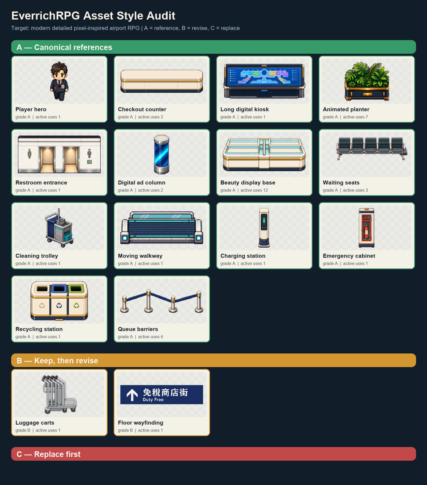
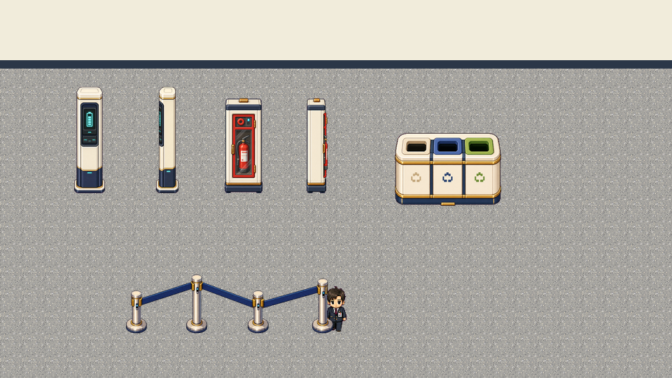

# EverrichRPG 現役資產風格稽核

> 歷史稽核紀錄：目前正式入口為 [`../../ART_PIPELINE.md`](../../ART_PIPELINE.md)。

稽核日期：2026-07-14
範圍：目前 Phaser 資產目錄、Tiled 九張區域地圖，以及代表性的角色、建築、商店與機場設施資產。



## 結論

目前的不統一不是單一素材失敗，而是多個資產世代同時成為正式資產：

- `legacy-directional-v1`：深藍、金色、高細節的精緻 pixel-inspired 店面與設施。
- `airport-directional-v1`：高細節、有明顯立體面的四方向大型設施。
- `airport-directional-v2`：較低像素密度、輪廓較硬的小型設施。
- `airport-reference-v3`：明亮暖白、商品細節豐富的模組化商店資產。
- `airport-terminal-details-v1`：同一批內也混有不同透視、描邊與像素密度。
- 角色使用高解析生成後縮放的 Q 版 pixel-inspired 風格，與純復古 16-bit 小物件不完全相容。

建議正式選擇 **modern detailed pixel-inspired airport RPG** 作為唯一主風格。它最接近目前完成度最高、重用率最高的角色、Kiosk、植栽、洗手間與 v3 商店資產，也能降低全面重畫成本。

## 稽核數據

- Tiled 區域地圖共有 `136` 個帶 `texture` 的物件。
- `51 / 136` 個物件的顯示寬度不是 16px 倍數。
- `55 / 136` 個物件的位置至少有一軸沒有落在 16px 格線。
- `worldAssetCatalog.ts` 同時載入 `v1`、`v2`、`v3`、`legacy` 與多個獨立動畫資產家族。
- 角色 frame 為 `96×96`，但目前主要顯示尺寸為 `40×40`，產生非整數縮放。場景物件也有多種自由縮放比例。

非格線尺寸不一定全部錯誤，例如招牌、懸空裝飾或特殊碰撞可以例外；但目前沒有 manifest 記錄例外原因，因此無法區分「刻意 overhang」與「產圖後直接套用尺寸」。

## A/B/C 定義

### A — 風格母版

可保留並作為後續產圖的可見參考：

| 資產 | 現役次數 | 作為母版的原因 |
| --- | ---: | --- |
| Player hero | 1 | 角色輪廓、深藍制服與可讀性基準 |
| Checkout counter | 3 | 暖白材質與模組化櫃台基準 |
| Long digital kiosk | 1 | 深藍、金色、青色科技設施基準 |
| Animated planter | 7 | 有機物、接地底座與細節密度基準 |
| Restroom entrance | 1 | 牆面設施、暖光與建築面基準 |
| Digital ad column | 2 | 圓柱科技設施與發光動畫基準 |
| Beauty display base | 12 | 目前重用最多的商店展示底座 |

### B — 保留結構後修正

物件辨識與功能正確，但需要統一色盤、輪廓、透視、像素密度或 tile footprint：

| 資產 | 現役次數 | 主要問題 |
| --- | ---: | --- |
| Waiting seats | 2 | 比 A 級資產更粗、更平，椅腳與扶手細節偏弱 |
| Luggage carts | 1 | 輪廓與對比太薄，在豐富背景上容易消失 |
| Cleaning trolley | 1 | 透視偏 isometric，黑色輪廓較重 |
| Moving walkway | 1 | 配色接近，但深度與 tile footprint 不夠明確 |
| Legacy service counter | 4 | 四方向版本尺寸與像素密度不一致 |
| Legacy sign pillar | 2 | 側面太薄、資訊面不足，遊戲尺寸下接近深色直線 |
| Floor wayfinding | 1 | 文字為平滑高解析邊緣，與像素群集語言不同 |

### C — 第一批重製

> 狀態（2026-07-14）：下列四項均已由 `airport-facilities-v3` 重製版本取代並切換至正式 TSJ／執行時 catalog；本表保留原始問題作為決策紀錄。

| 資產 | 現役次數 | 重製原因 |
| --- | ---: | --- |
| Charging station | 1 | 像素密度明顯較低，材質與 A 級科技設施不一致 |
| Emergency cabinet | 1 | 硬黑外框、大面積純紅與粗顆粒特別突兀 |
| Recycling station | 1 | 幾乎正面視角，缺少 3/4 上表面，像素尺度不同 |
| Queue barriers | 2 | 幾何太細、細節不足，並有偏紫輪廓邊緣 |

完整結構化分級位於 `docs/asset-style-audit/audit-manifest.json`。

## 第一批 10 個處理順序

1. `airport-charging-station-front/side`：依 Digital ad column 與 Long digital kiosk 重製。
2. `airport-emergency-cabinet-front/side`：保留安全紅色，但改用暖灰、深藍輪廓與一致上表面。
3. `airport-recycling-station`：重畫成可見頂面的 3/4 三分類桶組。
4. `airport-queue-barriers`：重製成與 Kiosk 相同金屬亮度及深藍織帶。
5. `airport-waiting-seats-horizontal/vertical`：鎖定同一座椅模組再輸出兩方向，不分開自由生成。
6. `airport-luggage-carts-front/side`：提高輪廓對比，兩方向共用輪子、把手與底部錨點。
7. `airport-cleaning-trolley`：保留內容配置，修正為專案的 3/4 俯視角。
8. `airport-sign-pillar-*`：重建四方向同源套件，側面保留可讀厚度。
9. `dutyfree-service-counter-*`：統一四方向 footprint、檯面高度與描邊。
10. `airport-floor-wayfinding`：文字內容不變，改用專案 bitmap/pixel 字體與 tile-aligned 邊界重製。

## 新的產圖與驗收流程

每個新資產不應只帶文字 Prompt，而應依序使用：

1. A 級資產組成的視覺母版圖。
2. 實際要放入的地板、牆面或商店區域截圖。
3. 固定的 `tileFootprint`、方向、底部錨點及最終顯示尺寸。
4. 產生高解析 raw 圖後，以同一後製流程量化、去背、去洋紅邊與縮放。
5. 在同一張地圖預覽中，與角色、Kiosk、植栽及櫃台並排驗收。

建議 manifest 至少新增：

```json
{
  "styleFamily": "modern-detailed-pixel-inspired-airport-rpg",
  "referenceBoard": "docs/asset-style-audit/asset-style-reference-board.png",
  "tileFootprint": [3, 2],
  "displaySize": [48, 32],
  "anchor": "bottom-center",
  "lightDirection": "upper-left",
  "grade": "A",
  "status": "approved"
}
```

## 尚未直接修改的項目

- 尚未替換任何正式 PNG。
- 尚未更動 Tiled 地圖位置、顯示尺寸或碰撞。
- 尚未決定角色由 `40×40` 改成 `48×48`；應先做 40/48 的遊戲內並排測試。
- 尚未將所有 701 張 sprites 拆幀逐張評分；第一輪以現役家族與代表資產為單位。

## 第一批 C 級候選資產

已建立 `public/assets/props/airport-facilities-v3`，包含：

- 充電柱 front / side
- 消防櫃 front / side
- 三分類回收桶
- 四柱排隊欄杆

這批採 one-by-one 產圖，沒有把高瘦設施與寬型欄杆混入同一張方形 prop pack。每張資產保留 raw 圖、手寫 Prompt、透明化中間檔與 pipeline metadata，正式輸出統一為 `2×` source density、bottom-center 錨點。狀態仍是 `candidate-not-wired`，尚未切換 Tiled 或 Phaser 正式引用。



## 重建對照板

使用工作區 Python 執行：

```powershell
python scripts/build-asset-style-audit.py
```

腳本只讀取現有 PNG 與 manifest，輸出 `docs/asset-style-audit/asset-style-reference-board.png`，不會改動遊戲資產。
